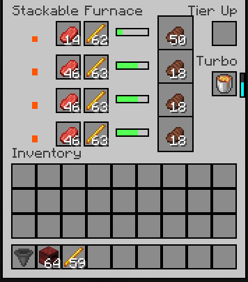

  <h1>🔥 Stackable Furnace</h1>
  

    <b>A multi-tier smelting system for Fabric 1.20.6.</b> 
  

<h2 align="center">🚀 Overview</h2>

  <b>Stackable Furnace</b> redefines the traditional smelting process by introducing a scalable block system. Instead of crafting multiple furnaces, you upgrade a single block through tiers, unlocking more smelting lines and increasing your industrial capacity within a single block space.

<h2 align="center">Key Features</h2>

  <table>
    <tr>
      <td><b>Multi-Tier Progression</b></td>
      <td><b>Global Turbo Boost</b></td>
    </tr>
    <tr>
      <td>Start at Tier 1 and upgrade up to Tier 4 using the furnace block itself. The cost is progressive (Tier 2: 1 block, Tier 3: 2 blocks, Tier 4: 3 blocks).</td>
      <td>A dedicated Turbo Slot (Slot 13) allows you to insert high-quality fuels to provide a global speed boost to all active smelting lines.</td>
    </tr>
  </table>

 

  <table>
    <tr>
      <td><b>Custom Code-Based GUI</b></td>
      <td><b>Container Compatibility</b></td>
    </tr>
    <tr>
      <td>A sleek, fully programmatic interface showing real-time progress for every active tier, eliminating the need for external textures.</td>
      <td>Full support for <code>RecipeRemainder</code>. Lava buckets return empty buckets, and fluid tanks from other mods are fully compatible.</td>
    </tr>
  </table>

<h2 align="center">🖥️ Interface & Usage</h2>

  The Stackable Furnace features a unique GUI that displays the status of each tier. As you upgrade the block, new slots are unlocked.

  
  
<i>Example of the Custom GUI with Turbo Bar and Tier Progress.</i>

<h3>The Turbo System</h3>

  Insert fuel into the <b>Turbo Slot</b> to accelerate all current operations. The boost multiplier is calculated using the square root of the item's base burn time, ensuring that while powerful fuels provide a massive edge, the game remains balanced.

<h2 align="center">⚙️ Automation & Logistics</h2>

  Designed for industrial modpacks, the Stackable Furnace supports full automation via Hoppers and Pipes. The I/O is strictly mapped by face:

  <table>
    <thead>
      <tr style="background-color: #f2f2f2;">
        <th>Face</th>
        <th>Function</th>
        <th>Description</th>
      </tr>
    </thead>
    <tbody>
      <tr>
        <td><b>Top</b></td>
        <td>Input</td>
        <td>Inserts materials into the active smelting lines.</td>
      </tr>
      <tr>
        <td><b>Sides</b></td>
        <td>Fuel</td>
        <td>Feeds fuel into the active burn slots.</td>
      </tr>
      <tr>
        <td><b>Bottom</b></td>
        <td>Output</td>
        <td>Extracts the finished smelted items.</td>
      </tr>
    </tbody>
  </table>

<h2 align="center">🛠️ Installation</h2>

  To use Stackable Furnace, ensure you have the following installed:

<ul>
  <li><b>Fabric Loader</b> (for Minecraft 1.20.6)</li>
  <li><b>Fabric API</b></li>
</ul>

  Simply drop the <code>stackable-furnace.jar</code> into your <code>mods</code> folder and launch the game.

  
<b>Version:</b> 1.0.0 | <b>Platform:</b> Fabric 1.20.6

